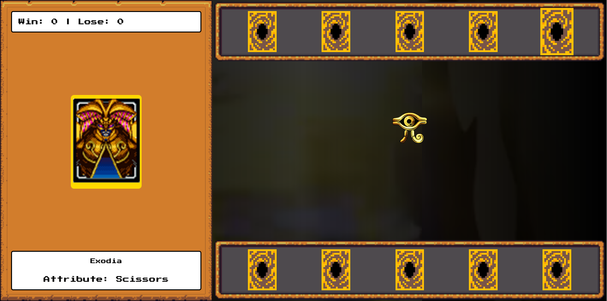
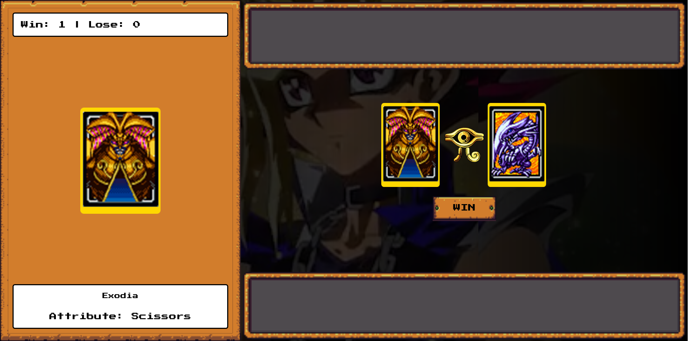

# YuGiOh-JoKenPo Edition 🎮✨

Este é um projeto de clonagem de jogo baseado no tradicional "Pedra, Papel e Tesoura", mas com a temática inspirada em **Yu-Gi-Oh**. O objetivo foi replicar a base do jogo utilizando **HTML**, **CSS** e **JavaScript** de forma interativa e visualmente envolvente. 🃏🎴

## Sobre o Projeto

Este jogo é uma versão de **Jokenpô** (Pedra, Papel e Tesoura), onde o usuário escolhe uma carta representando uma das opções e o computador faz sua escolha também. O conceito básico do jogo foi mantido, mas a estética e os elementos foram inspirados no universo do anime **Yu-Gi-Oh**. Durante o projeto, **replicamos a base** do jogo e, em seguida, **desenvolvemos a estrutura com HTML, CSS e JavaScript**. Algumas melhorias pessoais foram aplicadas ao código para enriquecer a experiência do jogo. 💻🖌️

## Objetivo 🎯

O objetivo deste projeto foi **replicar a base** de um jogo de **Pedra, Papel e Tesoura** com uma temática única de **Yu-Gi-Oh**, utilizando **HTML**, **CSS** e **JavaScript**. A construção da base foi feita durante o processo de aprendizado, e diversas melhorias pessoais foram implementadas ao longo do desenvolvimento. 🚀

## Parceria Dio e Bootcamp RiHappy 🤝

Este projeto foi desenvolvido em parceria com a **DIO (Digital Innovation One)** e o bootcamp da **RiHappy**. O bootcamp foi uma oportunidade para colocar os conhecimentos de desenvolvimento em prática, com ênfase em JavaScript e manipulação de DOM, além de aplicação de boas práticas de desenvolvimento front-end. 📚👨‍💻

## Como Jogar 🎮

1. Escolha uma carta da sua mão (Pedra, Papel ou Tesoura). ✋✌️🖐️
2. O computador também fará uma escolha aleatória. 🤖
3. O vencedor será determinado pelas regras clássicas do Jokenpô:
   - Pedra vence Tesoura ✊✂️
   - Tesoura vence Papel ✂️📄
   - Papel vence Pedra 📄✊

## Estrutura do Projeto 🏗️

Este projeto é composto pelos seguintes arquivos principais:

- **index.html**: Estrutura HTML do jogo.
- **style.css**: Estilos que fazem a interface visualmente atrativa.
- **script.js**: Lógica do jogo, gerencia as escolhas do jogador e do computador, e define o vencedor.

## Como Usar ⚙️

1. Clone este repositório para sua máquina local.
2. Abra o arquivo `index.html` no seu navegador.
3. Aproveite o jogo! 🎮🎉

## Exemplos do Jogo 📸

Aqui estão imagens de como o jogo aparece na tela:

*Imagem do jogo em funcionamento*

*Imagem mostrando a interação do jogador com o jogo*

## LinkedIn 🔗

Você pode me encontrar no LinkedIn para mais informações sobre meus projetos e habilidades de desenvolvimento:

[**Meu LinkedIn**](https://www.linkedin.com/in/marlon-alvss/)
